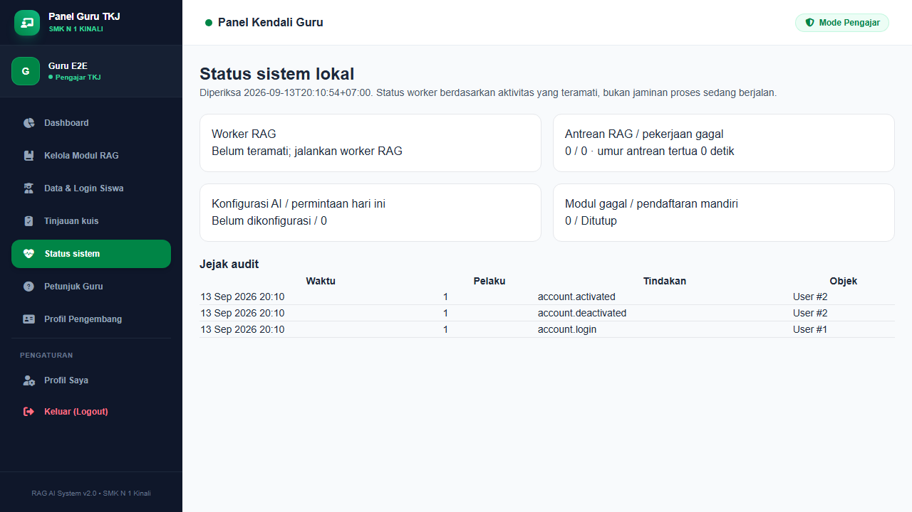

# Laporan penerapan audit — 13 September 2026

## Keputusan dan batas penerapan

Pemilik proyek mengizinkan pengerjaan empat tahap setelah audit awal. Kebijakan yang dipilih: pendaftaran mandiri ditutup di produksi, seluruh guru boleh mengelola seluruh siswa dan membaca transkrip, serta aplikasi tetap lokal. Perubahan kode, migrasi tambahan, dependensi, pengujian dan dokumentasi dikerjakan dalam scope tersebut. Tidak ada deployment, pengiriman email nyata, pembuatan akun pada database aplikasi, atau unggahan backup ke penyimpanan luar.

Implementasi lokal keempat tahap tersedia. **Evaluasi Gemini nyata selesai pada 14 September 2026 setelah izin khusus pemilik:** putaran pertama 11/15 berhasil dan empat error HTTP 429; setelah pengulangan berjeda, hasil gabungan 15/15 lulus pemeriksaan retrieval. Sembilan jawaban Gemini diperiksa terhadap sumber; enam kasus menghasilkan respons lokal tanpa sumber. Lihat [laporan evaluasi nyata](RAG_EVALUATION_20260914.md) untuk hasil, artefak dan batas pengujian. Pengujian fitur/browser/load di bawah tetap memakai fake/mock; penilaian pedagogis dan nilai kuis oleh guru belum dilakukan.

## Tahap 1 — keamanan akun, dependensi dan worker

| Temuan audit | Perubahan | Bukti verifikasi |
|---|---|---|
| Sesi lama masih dapat digunakan setelah reset password | Versi autentikasi meningkat saat password/status berubah; token pengingat diputar; sesi database dicabut; middleware memeriksa akun aktif, versi sesi dan hash autentikasi | Reset token nyata dalam test mencabut sesi dan menolak sesi versi lama dengan 401 |
| Host permintaan dapat memengaruhi URL reset | URL reset dibuat dari `APP_URL`; konfigurasi host/proxy tepercaya tersedia | Notification reset diuji memakai URL aplikasi yang ditetapkan |
| Pendaftaran mandiri tidak mengikuti kebijakan sekolah | GET dan POST pendaftaran ditutup bila konfigurasi menonaktifkan; default produksi tertutup; akun baru selalu siswa | Test PHP dan browser memeriksa 404 pada pendaftaran tertutup |
| Form forgot password membedakan email terdaftar | Respons publik seragam; normalisasi email dan batas input; throttle jalur pendaftaran/reset | Email tidak dikenal dan dikenal memberi status publik yang sama; notification hanya untuk akun yang ada |
| Akun nonaktif dan jejak audit belum tersedia | Status login siswa, verifikasi email opsional, audit login/logout/reset/perubahan akun dan modul | Akun nonaktif ditolak saat login maupun memakai sesi; jejak audit diuji |
| Worker deployment memakai koneksi default dan tidak diawasi | Skrip Windows mendengarkan koneksi `rag`; Supervisor Linux dan layanan worker terpisah disiapkan; retry-after database 360 detik | Browser mengunggah DOCX lalu memproses job lewat `queue:work rag --once` pada database fixture |
| Dependensi memiliki advisori | Guzzle 7.15.5, promises 2.5.3, PSR-7 2.13.1, CommonMark 2.10.1 dan nette/schema 1.3.6 dipasang; Nano ID dev diperbarui | Composer update melaporkan tidak ada advisori setelah pemasangan; npm audit melaporkan 0 kerentanan |

Audit Composer ulang mengalami timeout Packagist dua kali. Hasil “tidak ada advisori” berasal dari pemeriksaan otomatis pada proses update yang berhasil, bukan dari audit ulang yang timeout. Jalankan kembali `composer audit --locked` ketika koneksi Packagist tersedia.

`nixpacks.toml` tidak lagi menjalankan migrasi otomatis, worker lepas di background dan `artisan serve` dalam satu start. Konfigurasi memakai provider Nginx/PHP-FPM, mempertahankan paket provider lewat `...`, Node 22, `npm ci`, dan pemeriksaan platform Composer. Konfigurasi hosting/Supervisor disiapkan tetapi belum diuji dengan deployment nyata karena sistem masih lokal.

## Tahap 2 — konsistensi data dan antarmuka

| Temuan audit | Perubahan | Bukti verifikasi |
|---|---|---|
| Password yang diketik untuk siswa A tertinggal saat membuka siswa B | Form dan password direset saat modal dibuka/ditutup; konfirmasi reset menyebut pencabutan sesi | Browser membuka dua siswa dan memeriksa password siswa kedua kosong |
| Penghapusan akun menghapus riwayat dan meninggalkan avatar | Nonaktifkan menjadi pilihan untuk menjaga riwayat; penghapusan permanen membersihkan avatar setelah transaksi | Test memeriksa riwayat tetap ada saat nonaktif dan avatar hilang setelah hapus |
| Akun guru dapat menghapus seluruh modul miliknya melalui cascade | Transfer kepemilikan wajib sebelum penghapusan guru yang memiliki modul; guru aktif terakhir dilindungi; penghapusan guru diserialisasi dengan kunci baris | Test memeriksa penghapusan tanpa transfer ditolak dan chunk/modul bertahan setelah transfer |
| Kebijakan akses siswa belum dinyatakan jelas | Service akses siswa mengikuti kebijakan global seluruh guru; modul tetap dikelola pemiliknya | Guru lain dapat memperbarui siswa; akses modul orang lain tetap ditolak |
| Dashboard dan ekspor memakai definisi aktivitas berbeda | Service metrik bersama untuk siswa, aktivitas, pertanyaan biasa, kuis dan partisipasi; grafik pertanyaan hanya menghitung tanya materi | Regresi agregasi bulanan WIB dan jenis pertanyaan lulus di kedua database |
| Kelas, NIS dan NIP tidak menjadi data akun | Field akun ditambahkan; form siswa/profil guru dan ekspor memakai data tersebut, dengan fallback konfigurasi lama | Pembaruan kelas/NIS diuji; ekspor menghasilkan XLSX yang valid |
| Guru melihat video KB bawaan pada modul lain | Tautan tambahan tersimpan per modul; fallback hanya untuk berkas seed yang cocok; view guru/siswa memakai metode bersama | Regresi modul tidak terkait tidak menampilkan media bawaan |
| Detail modul menampilkan chunk sekaligus pesan “tidak ada chunk”, dan memuat vektor besar untuk preview | Preview mengambil teks/metadata saja, paginate 20, menampilkan seluruh teks yang dapat dibuka dan keadaan kosong yang benar | Browser memeriksa hasil ekstraksi DOCX dan ketiadaan pesan kosong pada modul berisi chunk |
| Jawaban biasa masih disimpan saat sumber berubah selama generation | Semua modul dan chunk jendela sumber divalidasi ulang dalam transaksi; versi indeks dan hash teks diperiksa sebelum publish | Penarikan sumber saat generation menghasilkan 409 tanpa membuat riwayat |

Snapshot sumber yang sudah ada tetap dipertahankan. Sumber tambahan riwayat lama yang tidak pernah disimpan tidak dapat direkonstruksi secara pasti. Riwayat lama tanpa hubungan kuis/rubrik tidak dipaksa diberi kunci atau nilai yang dibuat-buat.

## Tahap 3 — RAG, rubrik kuis dan evaluasi

1. **Scope modul/KB:** siswa memilih modul selain mapel; eligible chunks dan riwayat rewrite dibatasi pada scope yang sama. Link “Tanya AI Soal Materi Ini” membawa ID modul. Perubahan filter membatalkan kuis lama dan disimpan dalam URL agar scope tetap benar setelah reload. Modul tidak tersedia atau berbeda mapel ditolak sebelum API.
2. **Soal dan rubrik:** kuis baru memakai respons JSON yang divalidasi untuk soal, kunci dan 1–5 kriteria. Kunci/rubrik disimpan di server dan tidak masuk payload respons siswa. Kuis lama tanpa rubrik harus dibuat ulang.
3. **Penilaian dan tinjauan:** respons nilai JSON 0–100, feedback dan kriteria disimpan pada riwayat feedback yang terhubung ke soal. Nilai AI dinyatakan sementara. Semua guru dapat meninjau sumber, soal, rubrik dan jawaban, menetapkan nilai/catatan, serta menghasilkan audit perubahan. Nilai guru tampil pada riwayat siswa setelah reload dan dicantumkan terpisah dari saran AI pada ekspor transkrip; saran AI asli tetap tersedia untuk dibandingkan.
4. **Pengendalian API:** anggaran chat 55 detik diterapkan pada rangkaian panggilan/retry, timeout browser 65 detik, batas penggunaan akun/global harian dengan transaksi, anggaran indexing 270 detik dan batas 200 chunk per modul. Kuota dihitung per percobaan HTTP, bukan token atau rupiah. DOCX dibatasi sampai 50 MB setelah dekompresi dan 5.000 entri; dokumen input dibatasi 10 MB.
5. **Evaluasi:** fixture diperluas dari 5 menjadi 15 kasus. Evaluator menyediakan JSONL, pass rate, error, p95 serta precision/recall judul modul jika `expected_modules` disediakan. Kasus yang membutuhkan sumber tidak lagi lolos hanya karena daftar expected terms kosong. Validasi input, modul scope, hasil kosong, ringkasan, deadline/retry dan nilai tidak valid diuji.
6. **Pemeriksaan lokal:** `rag:check-index --strict` memeriksa teks/vektor/model/dimensi tanpa API. Hasil database aplikasi: modul 7 = 14 chunk, modul 8 = 20 chunk, modul 9 = 19 chunk; seluruhnya tersedia, vektor 3072 dimensi valid, nol chunk tidak valid.

Grounding jawaban dan kesesuaian nilai dengan penilaian guru belum dibuktikan oleh fake/mock. Dataset 15 kasus masih benchmark dasar. Untuk penerimaan mutu sekolah, perlu ground truth lebih luas dari guru, kasus lintas modul dan tingkat kesulitan, penilaian tiap kutipan terhadap sumber, serta perbandingan nilai AI dengan nilai guru. Threshold/top-k tidak diubah berdasarkan hasil tiruan. OCR otomatis belum diimplementasikan; PDF scan ditolak dengan petunjuk penanganan, dan guru dapat memeriksa hasil ekstraksi teks.

## Tahap 4 — pengujian, monitoring dan backup

| Pemeriksaan | Hasil |
|---|---|
| PHP SQLite | **100 test, 443 assertion, lulus** |
| PHP PostgreSQL | **100 test, 443 assertion, lulus**, pada database baru yang terpisah dan dihapus setelah selesai |
| JavaScript jsdom | **3 test lulus**, termasuk sanitasi HTML dan alur aksi kuis |
| Browser Chromium | **4 skenario lulus**: policy/CSRF, modal/status/monitoring, RAG/kuis/tinjauan/otorisasi, upload/worker/preview/ekspor/backup |
| Load fixture | **20 pengguna, 60 permintaan, 0 gagal**; p50 3.822 ms, p95 7.123 ms, p99 7.636 ms |
| Build Vite | Lulus dengan Node khusus proyek |
| Kompilasi Blade | Semua view berhasil dikompilasi |
| Indeks aplikasi lokal | 3 modul / 53 chunk valid, 0 tidak valid, dimensi 3072 |
| Backup PostgreSQL sebelum migrasi | Dump dan tiga berkas modul berhasil diverifikasi dan dipulihkan ke database sementara; 5 akun, 3 modul, 53 chunk, 32 chat cocok |
| Backup PostgreSQL setelah migrasi | Dump, tiga modul dan foto pengembang berhasil diverifikasi; 5 akun, 3 modul, 53 chunk, 32 chat, satu profil pengembang; tabel audit/kuota baru ikut dipulihkan |
| Backup SQLite fixture | Restore terpisah, integrity check dan jumlah baris cocok; perubahan isi dump ditolak karena checksum tidak cocok |
| npm audit | 0 kerentanan |
| CI | Workflow tersedia untuk SQLite/PostgreSQL/browser/load/build/audit; belum dijalankan di GitHub |

Load tersebut memakai **AI tiruan dan satu server PHP pengembangan**, sehingga tidak dapat digunakan untuk menyatakan kapasitas production atau p95 Gemini. Evaluasi Gemini nyata terpisah pada 14 September menghasilkan p95 7.013 ms pada hasil gabungan 15 kasus; angka ini mengecualikan jeda dan percobaan awal yang gagal serta bukan uji beban. Pengujian layanan email/hosting luar belum dilakukan. Pengujian browser bawaan Codex gagal terhubung karena error metadata sandbox; Chromium melalui Playwright proyek berhasil dipakai sebagai pengganti.

Halaman Status sistem dan `system:check` menunjukkan antrean, umur antrean tertua, pekerjaan/modul gagal, heartbeat worker, keberadaan konfigurasi API serta penggunaan harian. Tampilan tidak menganggap API pasti sehat hanya karena kunci ada. Statistik dashboard dilabeli sebagai data saat halaman dimuat.

Backup lokal mencakup seluruh database, dokumen modul, avatar dan foto pengembang dengan manifest SHA-256. Mode maintenance dan worker berhenti diwajibkan agar database/berkas konsisten. `.env` dan APP_KEY tidak masuk arsip. Restore drill tidak menimpa database aplikasi. Backup belum dienkripsi dan belum disalin ke penyimpanan luar. Jadwal/retensi/salinan luar merupakan keputusan operasional sebelum aplikasi dipakai secara rutin di sekolah.

## Tampilan hasil verifikasi



Tangkapan ini memakai akun dan database E2E, bukan informasi akun sekolah.

## Migrasi dan perlindungan data aplikasi

Migrasi tambahan `2026_09_13_000001_add_account_and_learning_controls` sudah diterapkan pada PostgreSQL lokal, batch 7. Isinya penambahan field, indeks, tabel audit dan kuota; tidak menghapus atau mengisi ulang akun, modul maupun riwayat.

Backup awal sebelum migrasi: `storage/app/backups/20260913-125830-418c6c53.zip`. Backup setelah migrasi: `storage/app/backups/20260913-131025-907008c2.zip` (5 berkas terverifikasi, termasuk dump dan foto pengembang). Restore drill memulihkan ke database sementara lalu menghapus hanya database latihan. Aplikasi sudah keluar dari maintenance. Data awal tetap 5 akun, 3 modul, 53 chunk dan 32 percakapan. Dokumen lama tidak diindeks ulang memakai API dalam penerapan ini.

## Prioritas pengembangan berikutnya

- Tindak lanjuti HTTP 429 yang ditemukan pada benchmark Gemini nyata, lalu minta guru menilai grounding/kutipan serta perbedaan nilai AI dengan nilai guru. Tambahkan ground truth judul/KB dan uji injection dengan konteks tersedia sebelum mengubah threshold. Rincian temuan ada dalam [laporan evaluasi](RAG_EVALUATION_20260914.md).
- Sebelum dipakai rutin oleh kelas, uji beban dengan PostgreSQL, web server sebenarnya dan pola pengguna sekolah. Retrieval saat ini tetap pemindaian vektor secara bertahap di PHP; pertimbangkan indeks vektor PostgreSQL bila korpus bertambah besar.
- Tetapkan jadwal backup, retensi, penyimpanan salinan di media lain dan latihan restore berkala. Konfigurasi layanan Windows/Linux yang berjalan permanen mengikuti kebutuhan lingkungan pemilik.
- Tambahkan OCR bila sekolah perlu memakai PDF scan. Preview dan penolakan dokumen tanpa teks sudah tersedia; pipeline OCR otomatis belum masuk penerapan ini.

## Penggunaan setelah penerapan

Lihat [panduan operasional](OPERATIONS.md) untuk menjalankan worker, membaca status, menutup pendaftaran di lokal bila diinginkan, mengisi NIS/NIP, memeriksa preview, meninjau kuis, membuat backup, latihan restore, dan rencana deployment. Tidak ada proses worker baru yang ditinggalkan sebagai layanan permanen oleh pekerjaan ini. Jalankan listener RAG saat mengunggah/reindex materi, atau gunakan `composer run dev` yang sudah mencakup listener.

Evaluasi langsung yang sudah dijalankan setelah izin pemilik:

```powershell
php artisan rag:evaluate tests/Fixtures/rag-evaluation.json --generate --output=storage/app/rag-evaluation-20260914.jsonl
```

Pemilik memberi izin eksplisit pengiriman pertanyaan evaluasi, riwayat contoh dan potongan modul ke API Google pada 14 September. Evaluasi selesai, termasuk pengulangan hanya empat kasus yang gagal karena HTTP 429. Kode, konfigurasi dan dataset tidak diubah dalam langkah ini. [Laporan hasil](RAG_EVALUATION_20260914.md) membedakan putaran pertama, hasil gabungan dan pemeriksaan sumber oleh asisten yang masih memerlukan tinjauan guru.

Rujukan teknis: [Laravel Queue](https://laravel.com/framework/docs/12.x/queues), [Gemini GenerateContent](https://ai.google.dev/api/generate-content), [Nixpacks PHP](https://nixpacks.com/docs/providers/php), [konfigurasi Nixpacks](https://nixpacks.com/docs/configuration/file).
